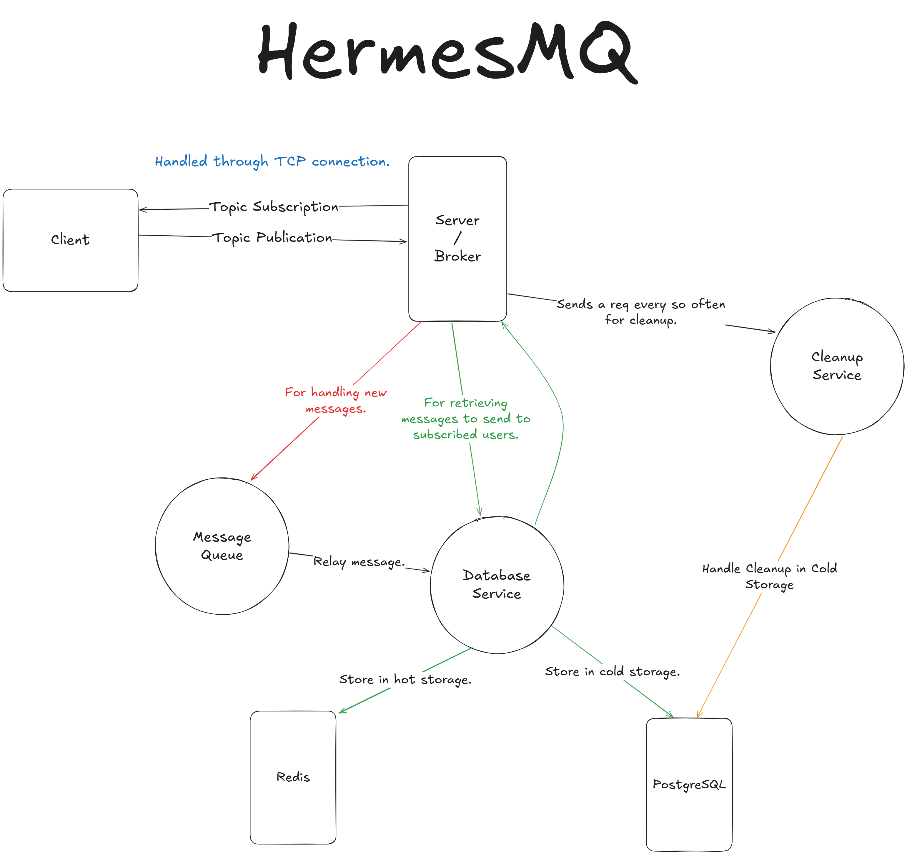

# HermesMQ

> “I found Kafka super interesting and wanted to try making my own from scratch.”

**Status:** WIP  
**Goal:** A lightweight, high-performance message queuing system using a Publish/Subscribe (Pub/Sub) architecture and a scalable **TCP** broker for low-latency, fault-tolerant delivery.

## Table of Contents
- [Overview](#overview)
- [Architecture](#architecture)
  - [Components](#components)
  - [Storage Strategy](#storage-strategy)
  - [Cursors & Offsets](#cursors--offsets)
  - [Scalability](#scalability)
- [Message Flow](#message-flow)
- [Functional Requirements](#functional-requirements)
- [Non-Functional Requirements](#non-functional-requirements)
- [Design Decisions](#design-decisions)
- [Architecture Diagram](#architecture-diagram)
- [Things To Do](#things-to-do)

## Overview
HermesMQ is a message broker built around **Pub/Sub**. Clients publish messages to topics and subscribe to topics they care about. The broker persists messages to **hot** and **cold** storage, delivers them to subscribers, and tracks per-subscription cursors so consumers can resume from where they left off—even after disconnects.

---

## Architecture

### Components

**Client**
- Publish or subscribe to a topic
- Stores local state: subscribed topics, last known cursors, connection status
- Reconnect (optional) and resume consumption

**Server/Broker**
- Manages topics, subscriptions, sessions, and connection lifecycle
- Ingests published payloads and assigns a **timestamp** + **message ID**
- Persists to hot (Redis) and cold (PostgreSQL) storage
- Enforces a **retention policy** (default: 31 days, configurable)
- Pushes/streams messages to connected subscribers
- Processes **ACKs** to advance subscriber cursors (offset pointers)
- Handles authentication (stored in PostgreSQL)

### Storage Strategy
- **Hot storage (Redis):** fast enqueue/dequeue path, recent messages, in-flight delivery
- **Cold storage (PostgreSQL):** durable, queryable history; supports replay up to retention window
- **Retention:** configurable (default **31 days**); background **cleanup service** prunes expired records

### Cursors & Offsets
- Per-subscription cursor management
- ACKs advance the cursor atomically
- Reconnect flow pulls from last acknowledged position

### Scalability
- Start with a **single broker (TCP server)**
- Future: add more brokers, replication, and partitioning/sharding strategies

---

## Message Flow
1. **Publish:** A client publishes a payload to a topic.  
2. **Ingest:** Broker receives payload, assigns **timestamp** + **message ID**.  
3. **Persist:** Broker writes to **Redis (hot)** and **PostgreSQL (cold)**.  
4. **Deliver:** Broker pushes/streams the message to all **connected** subscribers of that topic.  
5. **Acknowledge:** Subscribers send **ACKs**; broker advances their **cursor**.  
6. **Resume:** Disconnected clients can **reconnect** and **resume** from last cursor.

---

## Functional Requirements
- [ ] **Background:** *What is Pub/Sub Architecture?* (Do further research)
- [x] Client can **subscribe** to a topic
- [x] Client can **publish** to a topic
- [x] Server handles **connect** / **disconnect**
- [ ] **Auto-reconnection** (decide policy)
- [x] **Authentication** (store user info in PostgreSQL)
- [x] Server ingests **publish** payloads and validates them
- [x] Persist to **disk** and **durable storage** (Redis + PostgreSQL)
- [x] **Retention policy** (default 31 days; configurable)
- [x] Broker **sends** topic data to subscribers
- [x] **Ordering** by timestamps
- [x] Maintain **cursor** (offset pointer) per subscription
- [x] Allow **full-topic replay** (past + current within retention)
- [x] Start with a **single TCP broker**

---

## Non-Functional Requirements
- **Low latency:** use **TCP** for minimal protocol overhead
- **Scalable:** design for multi-broker in the future
- **High throughput:** efficient batching/I/O paths
- **High concurrency:** handle many simultaneous connections

---

## Design Decisions
- **Transport:** **TCP** (lower overhead vs HTTP/WebSocket)
- **Queue Ordering:** **timestamps** for temporal consistency within a topic
- **Storage:** **Redis** (hot) + **PostgreSQL** (cold) for speed + durability
- **Reconnect:** optional (policy TBD)
- **Authentication:** PostgreSQL-backed user store
- **Retention:** **31 days** (configurable) with a scheduled cleanup service
- **Cursors:** managed **per subscription** for precise resume semantics
- **Initial Topology:** **single broker**, plan forward for replication/partitioning

---

## Architecture Diagram
- Excalidraw: <https://excalidraw.com/#json=U-mWpDtgrH0StN0Lcw3T7,yVDxMYeLhUG6hf_9XxrKqQ>  
  *Note:* drawn for a **single broker**. Future scaling (replication/partitioning), cursor services, and hot/cold split services are not fully depicted.
  
  
